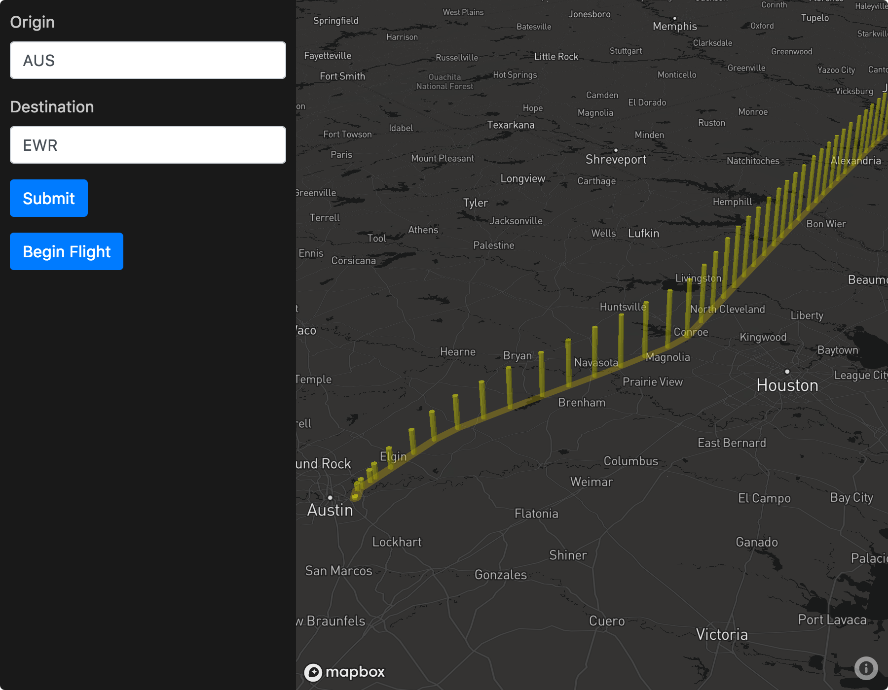

# flightquest
What's that on the ground?

# Premise

Whenever I get the window seat on an airplane, I'm always wondering what's down below.
I'm a map maker by trade, but my coding skills have always been lacking.
I'm using my strong interest in this problem to motivate me to write more code.

# Installation
- Make sure [Node.js](https://nodejs.org) is installed
- Clone or download the repository
- Open Terminal app (OSX) or PowerShell (WIN)
- Change directory (`cd`) to the app directory
- run `npm install`

# Start
`npm start`

# Credits
Airport data from [Openflights.org](https://openflights.org/data.html)  
Flight information from [FlightAware](https://flightaware.com/)
Map platform from [Mapbox](mapbox.com)  
Spatial tools from [Turfjs.org](www.turfjs.org)  
App wrapper by [Electron](https://electronjs.org/)
Developed in [Atom Editor](https://atom.io/)

# License
Licensed under Apache 2.0. Please see [License file](LICENSE)
